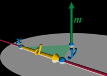

如何表示一条直线

## introduction

  

A line L in 3-dimensional Euclidean space is determined by two **distinct points** that it contains. With points $\displaystyle {x=(x_{1},x_{2},x_{3})}$ and $\displaystyle {y=(y_{1},y_{2},y_{3})}$.

The vector displacement from x to y represents the **direction of the line**. That is, every displacement between points on L is a scalar multiple of $d = y – x$. 

If a physical particle of unit mass were to move from x to y, it would have a **moment** about the origin. Treating the points as displacements from the origin, the moment is $m = x \times y$, where "×" denotes the vector cross product. 

Although neither **d** nor **m** alone is sufficient to determine L, together the pair does so uniquely: 
1. 由 底边 d 和 面积 m 而知道 高是一个固定大小的数值，那么范围就确定为半径为高大小的球体的切线
2. 由于 d 指定了底边的方向，那么切线只在能球面上的上下两条切线。
3. 由于叉乘具有方向，只有一条切线确定的$x \times y$符合m的方向。
  

PS:
$m = x \times y = x \times d$
## Main

a line $L$ can be represented by its direction $l$ and a point $p$ that it passes through. 

Plücker coordinates of the line L is defined to be $(l, m)$, where $m = p \times l$ is referred to as the **moment vector**.

> The second coordinate $m$ is independent of the choice of $p$

a different point p′ on the line satisfies $p′ − p = λl$, for some $λ$, thereby inducing 
$p′ × l = ( p + (p′ − p) ) ×l = p × l + (p′ − p) × l = m + λl × l = m$

> A point $q$ lies on the line $L$ if and only if $q × l = m$.

For the sufficiency, we see that $q × l = m$ implies $(q − r) × l = m − m = 0$, where $r$ is a point on the line. Thus, the vector $q − r$ is collinear with the line direction $l$. So $q$ must be on the line as well.

> distance from the origin to the line

  

Generally, such distance is given by $‖m‖/‖l‖$, achieved at $p⊥ = l × m/‖l‖^2$

Specially, when $l$ is a unit vector, the moment $‖m‖$ gives the distance from the origin to the line, achieved at the foot $p⊥$ of the line’s perpendicular through the origin.

If $m$ is zero, the line is through the origin.

  

> same line

Since $m$ scales with $l$, the Plücker coordinates $(l, m)$ and $(cl, cm)$, $c \neq 0$, describe the same line.

高不变。

> 平面

let $Π$ be the plane **containing the line and origin**. The vector $m$ is normal to the plane $\Pi$. 

We translate L in the direction of p within $\Pi$. The point $p$ becomes point $tp$, where $t$ represents some scalar multiple of the line’s original distance from the origin. The line's new Plücker coordinates becomes $(l, tp × l) = (l, tm)$.

Equivalently, these coordinates are $(l/t, m)$ since they are independent of scaling.

As the line is translated to infinity, we have $\displaystyle \lim_{t\to \infin} {(\dfrac{l}{t},m ) = (0, m)}$.

Hence, all the lines at infinity in $Π$, regardless of their directions, are described by the same Plücker coordinates $(0, m)$.

  

Parallel lines at infinity, however, lie in different planes through the origin, and thus have different values of $m$. 法向量不同。