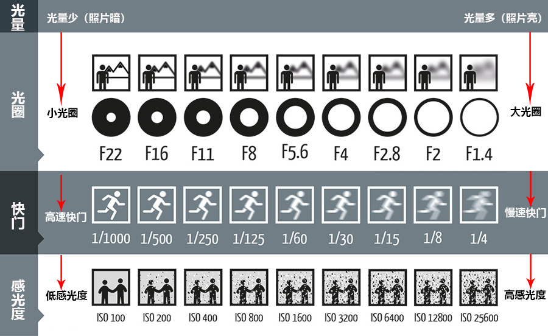
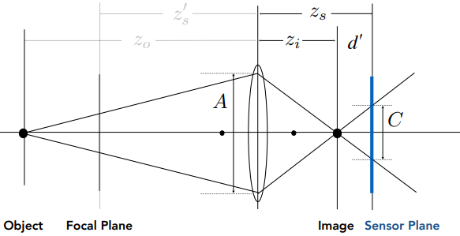
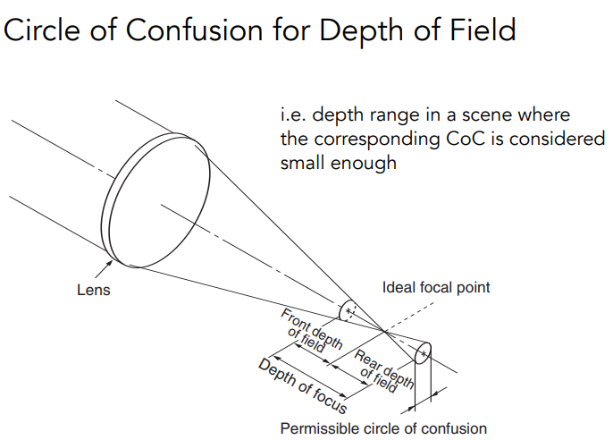
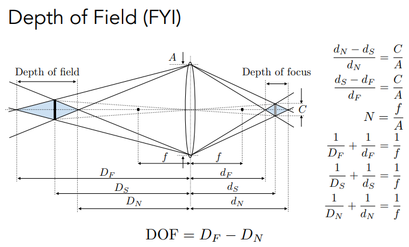

# Exposure

pinhole camera and lens camera. 这里讲的是lens camera，针孔相机的成像各处都是清晰的，没有景深，没有虚化。
## Equation
Exposure (H)：曝光，曝光度Exposure
- H = T x E 
- Exposure time (T) 
    - Controlled by shutter 
- Irradiance (E) 
    - 外界的光照强度
    - 相机的光圈大小和焦距

## Factors
  

- Aperture size 
    - f-stop/f-number: `F/N`（`FN`），`N`就是f-number.
    - $N=\dfrac{f}{A}$: the focal length $f$ divided by the diameter of the aperture $A$. 当焦距固定时，N 越大，光圈直径 A 越小。
    - 光圈大，前景没事，但背景就虚（景深丢失），即Circle of Confusion (CoC)。

- Shutter speed 
    - 单位是秒
    - 快门时间越长，则光亮越多。sensor不是记录瞬时功率，而是记录累积做功，即累计的irradiance。
    - 快门时间越长，则运动越模糊。快门时间越长，那么运动物体的形变程度就会越大。

- ISO gain 感光度
    - 后期处理，线性地把sensor values 乘个数放大，结果就是digital image values
      放大ISO，噪声所在的数值也被放大，让噪声更明显了。 
    - 实现可以用硬件或软件，analog and/or digital

> trick

夜景、光轨：小光圈、低ISO（噪声小），慢快门（弥补光量）。

白天运动：高速快门（瞬态不扭曲），大光圈、高ISO（弥补光量）

虚化: 大光圈（景深效果）、低ISO

> Circle of Confusion (CoC)

  

当相距固定在 Sensor Plane 和焦距是 f 时，那么物距就得是在 Focal Plane 处，而一旦不在时，真正最佳成像位置是在 Image 的一点处，而在 Sensor Plane处，由原来的一点变成一个光圈 Circle of Confusion。

上图是一种物距远的情况，还有另一种物距近的情况。

而 CoC 的大小是和光圈的大小成正比的。光圈越大，CoC越大，光圈越小，CoC 越小。即大光圈的虚化背景。

$$
\begin{aligned}
\frac{C}{A} & =\frac{d^{\prime}}{z_{i}}=\frac{\left|z_{s}-z_{i}\right|}{z_{i}} 
\\ C & =A \frac{\left|z_{s}-z_{i}\right|}{z_{i}}=\frac{f}{N} \frac{\left|z_{s}-z_{i}\right|}{z_{i}}
\end{aligned}
$$

  

当 CoC 处于可接受的范围时（比如小于一个像素的大小），那么物体所在的可接受距离就是 Depth of Field.

  