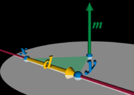

- **outer product**
- **dot product** (a special case of "**inner product**"), which takes a pair of coordinate vectors as input and produces a scalar
- **Kronecker product**, which takes a pair of matrices as input and produces a block matrix
- **Standard matrix multiplication**

## dot product / scalar product / projection product

$${\displaystyle \left\langle \mathbf {u} ,\mathbf {v} \right\rangle =\mathbf {u} ^{\textsf {T}}\mathbf {v} }$$

The dot product is the trace of the outer product.

**normalized vector**:
- When two vectors are **perpendicular** to each other (A.B), the result of the dot product between these two vectors is 0. 

- When the two vectors point in **opposite directions** (A.C), the dot product returns -1. 

- When they point in the **same direction** (A.D), it returns 1. 

- It is also used intensively to find out the angle between two vectors or compute the angle between a vector and the axis of a coordinate system (which is useful when the coordinates of a vector are converted to spherical coordinates.

## outer product
The outer product $\mathbf {u} \otimes_{\mathbf {outer}} \mathbf {v}$ is equivalent to a matrix multiplication $\mathbf {u} \mathbf {v} ^{\operatorname {T}}$.
$\mathbf {u}$ is represented as a $m\times 1$ column vector and $\mathbf {v}$ as a $n\times 1$ column vector.
For instance, if $\displaystyle m=4$ and $\displaystyle n=3$ then

$$\displaystyle \mathbf {u} \otimes \mathbf {v} 
=\mathbf {u} \mathbf {v} ^{\textsf {T}}
={\begin{bmatrix}u_{1}\\u_{2}\\u_{3}\\u_{4}\end{bmatrix}}{\begin{bmatrix}v_{1}&v_{2}&v_{3}\end{bmatrix}}={\begin{bmatrix}u_{1}v_{1}&u_{1}v_{2}&u_{1}v_{3}\\u_{2}v_{1}&u_{2}v_{2}&u_{2}v_{3}\\u_{3}v_{1}&u_{3}v_{2}&u_{3}v_{3}\\u_{4}v_{1}&u_{4}v_{2}&u_{4}v_{3}\end{bmatrix}}$$

- outer product is not commutative.
    $$\displaystyle {(\mathbf {u} \otimes \mathbf {v} )^{\textsf {T}}=(\mathbf {v} \otimes \mathbf {u} )}$$

## Kronecker product

If $\displaystyle \mathbf {u} ={\begin{bmatrix}1&2&3\end{bmatrix}}^{\textsf {T}}$ and $\displaystyle \mathbf {v} ={\begin{bmatrix}4&5\end{bmatrix}}^{\textsf {T}}$ , we have:

$$\displaystyle {\begin{aligned}\mathbf {u} \otimes _{\text{Kron}}\mathbf {v} &={\begin{bmatrix}4\\5\\8\\10\\12\\15\end{bmatrix}} 
\\ \mathbf {u} \otimes _{\text{outer}}\mathbf {v} &={\begin{bmatrix}4&5\\8&10\\12&15\end{bmatrix}}\end{aligned}}$$

In the case of column vectors, the Kronecker product can be viewed as a form of vectorization (or flattening) of the outer product. In particular, for two column vectors $\mathbf {u}$ and $\mathbf {v}$ , we can write:

$$\displaystyle \mathbf {u} \otimes _{\text{Kron}}\mathbf {v} =\operatorname {vec} (\mathbf {v} \otimes _{\text{outer}}\mathbf {u} )$$

## 叉乘 Cross product

https://en.wikipedia.org/wiki/Cross_product

$$\displaystyle {\mathbf a \times \mathbf b=-\mathbf b \times \mathbf a}$$

$$\displaystyle \mathbf {a} \times \mathbf {b} =\left\|\mathbf {a} \right\|\left\|\mathbf {b} \right\|\sin(\theta )\ \mathbf {n}$$

$\displaystyle {\mathbf {a\times b} ={\begin{vmatrix}\mathbf {i} &\mathbf {j} &\mathbf {k} \\a_{1}&a_{2}&a_{3}\\b_{1}&b_{2}&b_{3} \end{vmatrix}}
=(a_{2}b_{3}-a_{3}b_{2})\mathbf {i} -(a_{1}b_{3}-a_{3}b_{1})\mathbf {j} +(a_{1}b_{2}-a_{2}b_{1})\mathbf {k}}$

$\begin{array}{l}
C_{X}=A_{Y} * B_{Z}-A_{Z} * B_{Y} \\
C_{Y}=A_{Z} * B_{X}-A_{X} * B_{Z} \\
C_{Z}=A_{X} * B_{Y}-A_{Y} * B_{X}
\end{array}$

two vectors in a three-dimensional oriented Euclidean vector space.

$\mathbf a \times \mathbf b$ is a vector that is perpendicular to both $\mathbf a$ and $\mathbf b$, and thus normal to the plane containing them.

乘积的大小等于具有边向量的平行四边形的面积. 
- If the vectors a and b are parallel (that is, the angle θ between them is either 0° or 180°), by the above formula, the cross product of a and b is the zero vector 0.
- 还在这条线上，保持d的长度不变，滑动这条线段，乘积不变。
      

## exterior product / wedge product

$$\displaystyle {u\wedge v}$$

$$\displaystyle {u\wedge v=-(v\wedge u)}$$

In connection with the cross product, the exterior product of vectors can be used in arbitrary dimensions (with a bivector or 2-form result) and is independent of the orientation of the space.