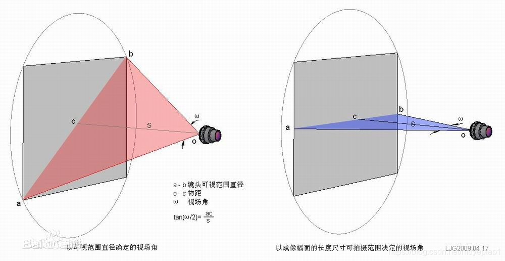
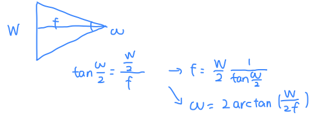

## 物像关系

$\dfrac{1}{f} = \dfrac{1}{d_1} + \dfrac{1}{d_2}$

f为焦距，d1为物距（物体到透镜的距离），d2为像距（透镜到像面的距离）。

[由此可以推出不同的成像关系](https://www.zhihu.com/question/38929736/answer/2327108553)

## FOV
视场角，即Field of view（FOV）。焦距越短，FOV越大；焦距越长，FOV越小。

公式就是tan三角函数联系起焦距与高宽、或物距与物高宽。

  


  

  W是图像的宽度，$\omega$是x轴的视角宽度，f是焦距。
```python
# `camera_angle_x`即在x轴的视角，对应图像的宽度。
focal = .5 * W / np.tan(.5 * camera_angle_x)

```
`"camera_angle_x": 0.5235987755982988,` 就是比如30°， Π/6 = 0.5235987755982988

`W`的单位是pixel， f的单位也是pixel。

## 相机坐标

相机的内参intrinsics，即**K**：固定不变的，如果不知道可以通过**标定**求得。
相机的外参extrinsics，即**T**：描述相机的位姿，即变换矩阵（Transform Matrix），由旋转R和平移t组成。
